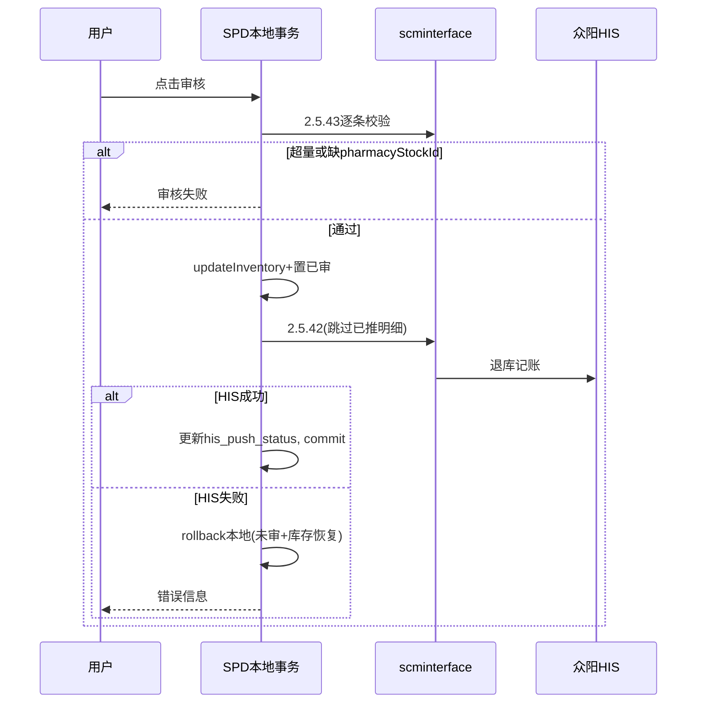

# 众阳 HIS 对接 — SPD 字段与逻辑完善评估（待确认）

> **文档版本**：v1.6  
> **编制日期**：2026-06-05  
> **依据**：接口文档3（枣强县中医院）、当前 `spd` / `scminterface` 代码与 DDL 现状  
> **状态**：**核心能力已编码**；院方确认项（§14）与部分优化仍待闭环  
> **适用租户**：已接入众阳 HIS 的 SPD 租户（当前仅 **`zaoqiang-tcm-001`**，见 `MsunHisTenantRegistry` / `MsunHospitalRegistry`）  
> **关联会话**：861fd963-f475-487d-aec4-45bf4856ca7a  

---

## 阅读指引

| 顺序 | 章节 | 内容 |
|------|------|------|
| 1 | §1 | 范围、已完成项、待办 |
| 2 | §2 | 租户隔离 |
| 3 | §3 | 功能总览 |
| 4 | §4 | 核心结论、**SPD 既有规则**、**pharmacyStockId 数据流** |
| 5 | §5～6 | 主数据、**完整 DDL 规划** |
| 6 | §7 | 推送前数据刷新 |
| 7 | §8～9 | 出库（201）、退库（401） |
| 8 | §10 | HIS 查看（镜像） |
| 9 | §11 | **跨系统编排与防单边账**（非 DB 事务包 HTTP） |
| 10 | §12～14 | 代码落点、实施顺序、待确认 |
| 11 | 附录 | 镜像机制、镜像表列补齐 |

---

## 1. 文档目的与范围

### 1.1 目的

汇总对接众阳 **2.5.41 入库**、**2.5.42 按批次退库** 时，SPD 需新增的字段、主数据对照、单据推送与 HIS 查看逻辑。

### 1.2 已完成

| 能力 | 状态 |
|------|------|
| 2.5.82 合并库存 + `m_msun_merge_stock` | 已实现 |
| 2.5.43 批次库存 + `m_msun_drug_batch_stock` | 已实现（列与 API 部分未对齐，见附录 B） |
| 2.5.82 落库后链式 2.5.43 | 已实现 |
| 主数据镜像 → SPD | 已实现（`MsunSpdMasterSyncExecutor`） |
| 镜像探针查询 `GET .../mirror/data/{probeKey}` | 已实现 |
| 2.5.41 / 2.5.42 **写库推送** | **已开放**（`ZaoqiangTcmMsunSpdPushController`，按 `hospitalKey` 路径） |
| `m_msun_push_log` + `mirror/bill-his` / `entry-his` | 已实现 |
| SPD 201/401 审核编排 + UI HIS 列 | 已实现（枣强租户） |
| 推送后即时校验（2.5.102 + 出库 2.5.43） | 已实现（`MsunHisPushVerifyService`） |
| `spdDetailId` 主表+明细拼接（`:` 连接符） | 已实现（`MsunHisConstants`） |
| 镜像表 `m_msun_*` + auto-schema | 已实现 |
| 租户枚举登记 | `MsunHospitalRegistry` ↔ `MsunHisTenantRegistry` |

### 1.3 待完成 / 待确认

| 模块 | 待办 |
|------|------|
| 主数据 | `fd_warehouse.his_id` 药库科室对照（院方确认列名见 §14） |
| 401 优化 | 从 201 继承 `his_memo`；`spdMainId` 传数字主表 id（§14 建议） |
| 院方确认 | `inStockStatus`、`isReturnToSupplier`、101 入库是否一期 |
| 部署联调 | 顺序 201 → 补退 → 401；现场配置 `spd.interface.ip/port` |
| 新客户 | 按《接口对接规范》§8 增加 Registry + 租户 Controller |

---

## 2. 租户隔离

与 `MsunHisTenantSupport.assertIntegrated()`、`TenantEnum.ZQ_TCM`、`MsunHospitalRegistry.ZAOQIANG_TCM` 一致。

| 功能 | 前端 | 后端 |
|------|------|------|
| 仓库 HIS 科室对照 | 仅枣强 | `tenant_id` 校验 |
| 出库推送 / 补退 | 隐藏 | 403 或 `ServiceException` |
| 退库 HIS 审核编排 | 非枣强走原审核 | 同上 |
| HIS 单据/明细查看 | 仅枣强 | SPD → scminterface |
| scminterface 推送/镜像 | — | `hospitalKey` / `tenantId` 枣强 |

**前端说明**：主数据「HIS 同步」若在 `spd-ui` 独立仓，HIS 查看/补退组件应 **同仓、同租户判断**（`zaoqiang-tcm-001`）。当前 `spd-biz` 仅有主数据同步后端，出库/退库 UI 待增。

---

## 3. 待完成功能总览

### 3.1 出库单（201）— 推送 + 补退

对应 **2.5.41**（药库 → 药房/二级库）。

| 功能 | 说明 |
|------|------|
| **单据推送** | 枣强租户审核时编排 2.5.41 |
| **补退** | **出库单补推送**（非退库）：仅推 `his_push_status ∈ {未推送, 失败}` 的明细 |

推送/补退前：重载单据 + 读 `his_push_status` + 可选 2.5.43/2.5.102 判重（`memo`/`spdDetailId`）。

### 3.2 退库单（401）— 门禁 + 审核后立即推送

对应 **2.5.42**。

| 阶段 | 说明 |
|------|------|
| 制单/打开 | 展示 SPD 科室库存 + HIS 可退量（镜像展示，审核用实时 2.5.43） |
| 审核门禁 | 逐条满足 §4.4 全部条件，否则禁用审核 |
| 审核 | 用户一次点击 → 后端单次 `auditStkIoBill` 编排（§9.3） |
| 审核后 | **同一次 API 内**立即 2.5.42；跳过已推送明细 |

### 3.3 HIS 查看

只读镜像；审核校验 **不得** 仅依赖镜像（§10.4）。

---

## 4. 核心结论与场景

### 4.1 仓库 ↔ HIS 科室

| 众阳字段 | SPD 映射 | 现状 |
|----------|----------|------|
| `storageDeptId` | `fd_warehouse.his_id`（推荐，注释：HIS 药库科室 ID） | **缺** |
| `pharmacyDeptId` | `fd_department.his_id` | 已有 |
| `supplierId` | `fd_supplier.his_id` | 已有 |
| `drugId` | `fd_material.his_id`（= 镜像 `drug_id`，见主数据同步代码） | 已有 |
| `drugSpecPackingId` | `fd_material.his_spec_packing_id` | 已有 |

> **命名建议**：仓库与 `fd_department.his_id` 统一用 `his_id`，避免 `his_dept_id` 与科室历史废弃列混淆；若坚持用 `his_dept_id` 须在 §14 确认。

### 4.2 单据与 HIS 接口

| SPD | `bill_type` | HIS | 一期 |
|-----|-------------|-----|------|
| 低值出库 | 201 | 2.5.41 | **是** |
| 低值退库 | 401 | 2.5.42 | **是**（依赖 201 回写 `pharmacyStockId`） |
| 低值入库 | 101 | 2.5.41 入药库 | **待定**（若药库也需 HIS 库存则纳入） |

### 4.3 `pharmacyStockId` 数据流（退库前置）

```
201 出库审核
  → 2.5.41 成功
  → 回写 stk_io_bill_entry.his_pharmacy_stock_id（及 his_memo 等）
  → 同步到 stk_dep_inventory（按 dep_inventory_id / bill_entry_id）
出库审核已插入科室库存（receipt_confirm_status=0，现有代码）
  → 科室收货确认（receipt_confirm_status=1，现有代码）
401 退库
  → 读取 dep_inventory.his_pharmacy_stock_id
  → 2.5.43 校验数量 → 2.5.42 推送
```

**未实现 201 推送前，401 无法完整联调。**

### 4.4 SPD 既有退库规则（须在 HIS 规则之上保留）

来源：`StkIoBillServiceImpl.auditStkIoBill` / `updateInventory`（401）。

| 规则 | 说明 |
|------|------|
| 科室库存须 **收货确认** | `stk_dep_inventory.receipt_confirm_status = 1` |
| 退库数量 ≤ **SPD** 科室库存 | 现有 `qty.compareTo(stkDepInventoryQty)` |
| 批次/科室库存行锁定 | `dep_inventory_id` 或 `batch_no` + 仓库一致 |
| 仓库与科室库存归属一致 | `warehouse_id` 校验 |

**枣强 401 完整门禁（建议）**：

```
receipt_confirm_status = 1
AND entry.qty ≤ SPD 科室库存 qty
AND entry.qty ≤ HIS stockAmount（2.5.43 实时）
AND his_pharmacy_stock_id 非空
AND 仓库/科室 HIS 对照完整
```

---

## 5. 主数据

### 5.1 `fd_warehouse`（P0）

| 字段 | 说明 |
|------|------|
| `his_id` varchar(128) | 众阳 2.1.9 药库科室 ID → `storageDeptId` |
| `UNIQUE(tenant_id, his_id)` | 租户内唯一（`his_id` 非空时） |

无对照 → 禁止 HIS 推送（后端强校）。

### 5.2 已有

`fd_department.his_id`、`fd_supplier.his_id`、`fd_material.his_id` / `his_spec_packing_id`、`sys_user.his_identity_id`、`fd_unit.his_unit_id`。

### 5.3 2.5.41 出库 `supplierId` 取值

接口 **必填** `supplierId`。201 主表 `suppler_id` 可能为空。

**建议**：从明细 `suppler_id` 或科室库存/仓库库存关联供应商 → `fd_supplier.his_id`；主表与明细均无法解析则 **禁止推送**。

---

## 6. 数据库字段规划（完整）

写入 `spd/spd-admin/.../material/column.sql`（及必要时 `table.sql`）。

### 6.1 `stk_io_bill`

| 字段 | 类型 | 说明 | 优先级 |
|------|------|------|--------|
| `his_in_stock_status` | varchar(8) | 2.5.41 `inStockStatus` | P0 |
| `his_storage_dept_id` | varchar(128) | 推送快照 `storageDeptId` | P0 |
| `his_pharmacy_dept_id` | varchar(128) | 推送快照 `pharmacyDeptId` | P0 |
| `his_spd_main_id` | varchar(64) | `spdMainId`，建议 `bill_no` | P0 |
| `his_save_correlation_flag` | char(1) | 建议默认 `1` | P1 |
| `his_is_return_to_supplier` | char(1) | 2.5.42，默认待院方确认 | P1 |
| `his_push_status` | varchar(16) | 未推送/推送中/成功/失败 | P0 |
| `his_push_time` | datetime | 最近推送时间 | P0 |
| `his_push_msg` | varchar(500) | 失败原因 | P0 |
| `his_trace_id` | varchar(64) | HIS `traceId` | P1 |

### 6.2 `stk_io_bill_entry`

| 字段 | 类型 | 说明 | 优先级 |
|------|------|------|--------|
| `his_memo` | varchar(128) | 明细对照键，租户内唯一 | P0 |
| `his_spd_detail_id` | varchar(64) | `spdDetailId`：`{billMainId}:{entryDetailId}`，预留条码第三段 `{billMainId}:{entryDetailId}:{barcodeDetailId}`；规则见 `MsunHisConstants` | P0 |
| `his_pharmacy_stock_id` | varchar(64) | 2.5.41 回写；2.5.42 **必填** | P0 |
| `his_storage_stock_id` | varchar(64) | 药库批次 ID | P0 |
| `his_stock_query_id` | varchar(64) | 合并库存 ID | P1 |
| `buy_price` | decimal(18,6) | 进价 | P0 |
| `retail_price` | decimal(18,6) | 零售价 | P1 |
| `invoice_code` | varchar(128) | 明细发票号 | P1 |
| `his_push_status` | varchar(16) | 行级状态（补退/防重） | P0 |
| `his_push_msg` | varchar(500) | 行级错误 | P1 |
| `his_drug_id` / `his_drug_spec_packing_id` | varchar(64) | 推送快照 | P1 |

### 6.3 `stk_dep_inventory`

| 字段 | 类型 | 说明 | 优先级 |
|------|------|------|--------|
| `his_pharmacy_stock_id` | varchar(128) | 退库权威键 | P0 |
| `his_stock_query_id` | varchar(128) | 对账 | P1 |
| `his_storage_stock_id` | varchar(128) | 来源药库批次 | P1 |

> `stk_inventory.his_id` 已存在；建议 **新增** `his_storage_stock_id` 或书面约定 `his_id` = `storageStockId`（§14 确认）。

### 6.4 scminterface 镜像表补齐（附录 B）

`m_msun_drug_batch_stock` 增加 `pharmacy_stock_id`、`stock_amount`、`yc_stock_query_id` 等，与 2.5.43 API 对齐。

### 6.5 可选 `m_msun_push_log`

| 字段 | 说明 |
|------|------|
| `spd_bill_id` / `spd_entry_id` | SPD 主键 |
| `bill_no` / `bill_type` | 冗余 |
| `api_code` | 2.5.41 / 2.5.42 |
| `request_json` / `response_json` | 报文 |
| `his_trace_id` | 追溯 |
| `push_status` | 成功/失败 |

供 **推送后**「HIS 单据查看」与防重复。

---

## 7. 推送前数据刷新

「下载」= 重载 SPD 单据 + 实时/镜像查 HIS，非导出 Excel。

| 步骤 | 出库 201 | 退库 401 |
|------|----------|----------|
| 1 | 重载主单+明细 | + `stk_dep_inventory` |
| 2 | `his_push_status` | + `his_pharmacy_stock_id` |
| 3 | 2.5.43 判重（可选） | **必须** 2.5.43 `stockAmount` |
| 4 | 过滤已推明细 | 超量行禁用审核 |

---

## 8. 出库单（201）

### 8.1 审核编排（枣强）

在现有 `auditStkIoBill` 内增加租户分支（参考衡水 `tryApplyOutboundReceiptConfirmation`）：

```
MsunHisTenantSupport.assertIntegrated（调用侧或 Service 内）
→ 推送前校验（§7）
→ updateInventory（现有）
→ 2.5.41 推送未成功明细
→ 回写 pharmacyStockId 到 entry + dep_inventory
→ 主表/明细 `his_push_status=成功`；推送后即时 2.5.102（±15min、`instockCode=billNo`）校验 HIS 是否落明细
→ 出库另查 2.5.43 批次库存；异常写入 `his_push_msg`（不回滚推送）
→ 失败抛 ServiceException → @Transactional 回滚本地
```

### 8.2 补退

已审核、部分明细未推：单独 API，仅推 `未推送/失败` 行；推送前 §7 判重。

### 8.3 HIS 查看

§10；推送前仅能查库存类镜像，推送后查 `m_msun_push_log`。

---

## 9. 退库单（401）

### 9.1 前置条件

§4.3、§4.4；租户枣强。

### 9.2 界面（未审核）

展示：SPD 科室库存、HIS 可退量（镜像 `stock_amount` 或 `raw_item_json`，见附录 B）、行级校验状态、「查看 HIS 明细」。

### 9.3 审核 API 编排（`auditStkIoBill` 枣强分支）

**一个 HTTP 请求内顺序执行**（非用户两次点击）：

| 步骤 | 动作 | 失败时 |
|------|------|--------|
| ① | 重载退库单 + 科室库存 | 终止 |
| ② | 校验 §4.4（含 **实时** 2.5.43 逐条 `qty ≤ stockAmount`） | 审核失败，不扣库存 |
| ③ | `updateInventory`（现有 401 逻辑，扣科室/补仓库） | — |
| ④ | 更新 `bill_status=2` 等（现有审核落库） | — |
| ⑤ | **立即** 2.5.42：跳过 `his_push_status=成功` 的明细 | — |
| ⑥ | 更新行级 `his_push_status`；写 `m_msun_push_log`（若有） | — |
| ⑦ | 本地全部成功 → `commit` | — |
| ⑧ | ⑤⑥任失败 → **抛异常回滚 ③④**（本地未审、库存恢复） | 见 §11.2 |

> **注意**：步骤 ③④ 与 ⑤⑥ 在 **同一 Spring `@Transactional` 本地事务** 中；**不包含** HIS HTTP 的 ACID。见 §11。

### 9.4 2.5.42 报文

`storageDeptId`、`pharmacyDeptId`、`isReturnToSupplier`、`outStockDetailDTOList[]`（`pharmacyStockId`、`quantity`、`memo`）。

---

## 10. HIS 单据 / 明细查看

### 10.1 入口

出库/退库详情或列表「HIS 单据查看」；明细行「HIS 明细查看」。仅枣强。

### 10.2 推送前 vs 推送后

| 时机 | 可查内容 | 数据来源 |
|------|----------|----------|
| **推送前** | 合并/批次库存、入退库流水（若已拉取） | `m_msun_merge_stock`、`m_msun_drug_batch_stock`、`m_msun_yk_instock*`；按科室+耗材+批号匹配 |
| **推送后** | 上述 + **本单推送记录** | + `m_msun_push_log`（按 `bill_id`/`spdMainId`） |

推送前 **无法** 按 SPD 单号精确查「HIS 单据」，仅能查关联库存镜像。

### 10.3 镜像匹配键

| 场景 | 表 | 匹配条件 |
|------|-----|----------|
| 明细 → 批次 | `m_msun_drug_batch_stock` | 优先 `pharmacy_stock_id`（列补齐后）= `his_pharmacy_stock_id`；否则 `dept_id+drug_id+drug_spec_packing_id+batch_number`；过渡期解析 `raw_item_json` |
| 合并库存 | `m_msun_merge_stock` | `dept_id+drug_id+drug_spec_packing_id` |
| 入退库流水 | `m_msun_yk_instock` / `detail` | 科室、时间、`instock_code` |

### 10.4 接口

| 状态 | API |
|------|-----|
| **已有** | `GET .../mirror/data/{probeKey}`（全表分页，不适合按单查） |
| **待增 P0** | `GET .../mirror/entry-his?entryId=&pharmacyStockId=` |
| **待增 P1** | `GET .../mirror/bill-his?billId=&billType=`（依赖 `m_msun_push_log` 或关联键） |

### 10.5 与审核校验

| 用途 | 数据源 |
|------|--------|
| 界面展示 | 镜像（可滞后） |
| 退库审核数量 | **实时 2.5.43** |
| 「刷新镜像」按钮 | 触发 2.5.43 写入镜像，**不替代**审核实时校验 |

---

## 11. 跨系统编排与防单边账

### 11.1 原则

| 误区 | 正确表述 |
|------|----------|
| 「HIS 推送与 SPD 同一数据库事务」 | **错误**。HIS 为 HTTP，仅 SPD 库表在同一 `@Transactional` 内 |
| 可行方案 | **单请求编排**：先本地校验 → 改本地库存 → 调 HIS → 成功 commit / 失败 rollback 本地 |
| HIS 已成功、本地 rollback 失败 | **HIS 无法随 DB 回滚**；靠 `memo`/`spdDetailId` 幂等 + `m_msun_push_log` + 运维补偿（§14） |

### 11.2 退库时序



### 11.3 出库与补退

- 首次审核：本地库存变更与 2.5.41 编排同上；失败回滚本地。
- **补退**：已审后仅推失败行；不再回滚已审状态（仅更新行级 `his_push_status`）。

### 11.4 `his_push_status`

| 状态 | 含义 |
|------|------|
| 未推送 | 可推 |
| 推送中 | 超时对账用 |
| 成功 | **禁止重复推** |
| 失败 | 可补退（201）或改单重审（401） |

---

## 12. 代码落点（结合现有工程）

| 层级 | 位置 | 动作 |
|------|------|------|
| spd-biz | `StkIoBillServiceImpl.auditStkIoBill` | 枣强 + `bill_type` 201/401 分支 |
| spd-biz | `MsunHisBillPushServiceImpl` | `/api/spd/msun/hospitals/{hospitalKey}/push/*` |
| spd-biz | `MsunHisPushVerifyService` | 推送后 `spd/query/yk-instock`、出库 `drug-batch-stocks` |
| spd-biz | `MsunHisConstants` | `spdDetailId` 拼接 `:`、解析 `parseSpdDetailId` |
| spd-biz | `MsunHisTenantRegistry` / `MsunHisTenantSupport` | 与 scminterface 枚举对齐 |
| spd-biz | `MsunHisMirrorProxyController` | 按租户代理 `.../mirror/*` |
| scminterface | `ZaoqiangTcmMsunSpdPushController` | 2.5.41 / 2.5.42 / 2.5.43 |
| scminterface | `ZaoqiangTcmMsunMasterSyncController` | `.../sync/{type}` |
| scminterface | `ZaoqiangTcmMsunMirrorQueryController` | `entry-his` / `bill-his` |
| scminterface | `resources/sql/mysql/msun_his_mirror/01_table.sql`、`02_column.sql` | 镜像 auto-schema；索引见 `database/msun_his_mirror/README.md` |
| spd-admin | `sql/mysql/material/column.sql` §众阳 HIS | 业务表对照列、推送字段、UPSERT 唯一键 |
| spd-ui | 出库/退库/仓库页 | `MsunHisViewButton`、补退、行级状态 |

**不宜**新建平行审核接口，避免与库存、流水、收货确认逻辑脱节。

---

## 13. 实施顺序

| 阶段 | 内容 | 依赖 |
|------|------|------|
| 0 | 租户白名单（前后端） | — |
| 1 | `fd_warehouse.his_id` + 仓库 UI | 2.1.9 已同步 |
| 2 | SPD 单据/库存 DDL（§6） | — |
| 3 | 镜像表列补齐（附录 B） | — |
| 4 | scminterface：2.5.41/2.5.42 推送 | — |
| 5 | scminterface：`mirror/entry-his` | 3 |
| 6 | spd-biz：**201 审核推送** + 回写 `pharmacyStockId` | 1,2,4 |
| 7 | spd-biz：**401 审核编排** | **6 必须完成** |
| 8 | spd-ui：HIS 查看 + 补退 + 门禁展示 | 5 |
| 9 | `m_msun_push_log` + `bill-his` + 对账 | 可选 |

---

## 14. 待确认清单

| # | 问题 | v1.4 建议 |
|---|------|-----------|
| 1 | 仓库 HIS 列名 | `fd_warehouse.his_id`（与科室一致） |
| 2 | 出库 `inStockStatus` | 院方确认 |
| 3 | 101 入库是否一期 | 若药库对接 HIS 则纳入 |
| 4 | `stk_inventory.his_id` | 新增 `his_storage_stock_id` 或复用 `his_id` |
| 5 | `memo` / `spdDetailId` | `memo`=`ZQ-{tenant}-{entryId}`；`spdDetailId`=`{billId}:{entryId}`（`:` 连接，条码预留第三段）；解析见 `MsunHisConstants.parseSpdDetailId` |
| 6 | `isReturnToSupplier` 默认 | 院方确认 |
| 7 | HIS 推送成功、本地 commit 失败 | 补偿流程 + 禁止盲目重推 |
| 8 | 镜像查看是否允许手动刷新 2.5.43 | 建议允许（仅枣强） |
| 9 | 溯源码 | 院方是否必填 |
| 10 | 推送失败回滚本地审核 | **是**（§9.3 ⑧） |

---

## 附录 A：镜像 Upsert

- `INSERT ... ON DUPLICATE KEY UPDATE`
- 不删历史未返回行；2.5.102 明细先删后插

---

## 附录 B：`m_msun_drug_batch_stock` 与 API 对齐

| 2.5.43 API | 当前镜像列 | 建议 |
|------------|------------|------|
| `pharmacyStockId` | 无（仅 `stock_id`） | 新增 `pharmacy_stock_id` |
| `stockAmount` | `quantity`（映射可能失败） | 新增 `stock_amount` |
| `ycStockQueryId` | 无 | 新增 `yc_stock_query_id` |
| `effectiveDate` | `effective` | 保留 |
| 过渡期 | `raw_item_json` | HIS 明细查看可解析 JSON |

---

## 修订记录

| 版本 | 日期 | 说明 |
|------|------|------|
| v1.0～v1.3 | 2026-06-05 | 见历史 |
| v1.4 | 2026-06-05 | 评审修订：跨系统事务表述、§4.3/4.4 数据流与既有规则、完整 DDL、镜像列对齐、推送前后查看区分、代码落点、实施依赖 201→401 |
| v1.5 | 2026-06-05 | 与《接口对接规范》对齐：按 hospitalKey 的 SPD API、双端 Registry、核心能力标为已实现 |
