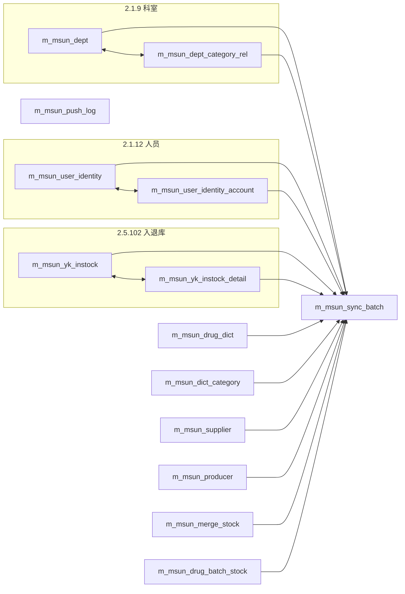

# 外部系统接口对接规范 — 镜像表与自动 Schema

> **版本**：v1.3  
> **适用范围**：scminterface 前置机对接各类外部系统（HIS、供应链平台等）；镜像表落在 **SPD 业务库**（与业务表同库，不建独立镜像库）。  
> **参考实现**：众阳云健康（厂商代码 `msun`，表前缀 `m_msun_`）。

### 规范层级

| 层级 | 含义 | 示例 |
|------|------|------|
| **强制性** | 必须遵守 | 镜像命名 `m_{vendor}_*`、双端 Registry、按租户 API 前缀 |
| **目标架构** | 新接入默认按此实现 | `ZaoqiangTcmMsunSpdPushController` 路径模式 |
| **参考实现** | 以 msun/枣强为准，随代码演进 | 类名见 §14 |

---

## 1. 文档目的

对接外部系统时，若存在**下载/拉取对方数据**且该数据与 SPD 业务存在**对照、同步、推送回写、对账**等联动关系，必须保留**可追溯的原始快照**，避免对方主数据变更、接口字段调整或争议排查时「找不到当时来源」。

本规范约定：

1. **默认建镜像表**落库外部数据原始行及元数据；
2. **统一命名** `m_{厂商英文或拼音}_{对象名}`，多厂家隔离、避免撞名；
3. **接口调用前自动建表/补列**；存在**联动表**时一并创建与补全；
4. SPD 业务表仅存**当前有效对照**；镜像表承担**历史溯源**职责；
5. **每新增一个客户租户**，**单据调用入口（Controller/API 前缀）必须独立**；接口测试页可 per-tenant HTML，或共用探针页 + 医院下拉（须能切换至该租户 `apiPrefix`）；
6. **SPD 新增客户租户时**，scminterface 同步在**客户租户枚举**中登记一项，与 SPD `TenantEnum` 对照，便于开发维护接口时识别客户。

---

## 2. 核心原则

| 原则 | 说明 |
|------|------|
| 镜像优先 | 凡「拉取外部数据 → 写入/更新我方业务表」或「推送我方数据 → 需对账」的场景，**先落镜像、再（可选）同步业务表** |
| 同库落表 | 镜像表建在 SPD 业务库（如 `aspt`），使用 SPD 数据源；**不**单独建镜像库 |
| 厂商隔离 | 表名必须带厂商前缀，禁止各厂家共用 `m_dept`、`m_supplier` 等无前缀表名 |
| 按需建表 | 仅在实际调用到的接口所涉及的表上执行 `CREATE` / `ALTER`，不做全量预建 |
| 联动展开 | 主表触发时，自动展开并确保从表、批次表、推送日志表等**联动表**结构就绪 |
| 非阻断 | 自动建表/落库失败时，默认**不阻断**接口返回（可配置为失败即中断） |
| 原始可溯 | 每行保留 `raw_item_json`（或等价字段）及请求上下文，字段映射不全时可从 JSON 补数 |
| 租户隔离 | **厂商能力下沉 Service 层复用**；**租户差异上浮到独立 Controller / 配置 / 测试页**，禁止在公共代码中硬编码 `if (某医院)` |
| 枚举登记 | SPD `TenantEnum` 与 scminterface `{Vendor}HospitalRegistry`（或等价枚举）**成对维护**，`customerId` = `hospitalKey`，作为对接客户的权威登记册 |

---

## 3. 何时必须建镜像表

### 3.1 必须建（默认）

满足以下**任一**条件，**必须**定义并落库镜像表：

- 从外部系统**查询/下载**主数据或业务数据，并用于更新 SPD 主数据（科室、人员、耗材、供应商等）；
- 拉取的数据作为 SPD 推送、审核、退库门禁等逻辑的**对照依据**（如 HIS 批次库存）；
- 向外部系统**推送** SPD 单据，需保留请求/响应报文供运维对账（推送日志表）；
- 外部接口返回**主子结构**（如科室 + 分类列表、入退库主单 + 明细），需拆表落库；
- 存在**定时同步**或探针联调，需要按批次追溯数据来源。

### 3.2 可不建（需评审备案）

- 纯透传、不落库、且与 SPD 业务无字段对照的一次性调用；
- 仅返回实时计算结果、不要求历史留痕的查询；
- 已有其他可追溯机制（如统一审计日志且含完整报文）并经架构评审确认。

### 3.3 业务表与镜像表分工

```
外部系统 API
    │
    ▼
┌─────────────────┐     可选 upsert      ┌──────────────────┐
│  m_{厂商}_*     │ ──────────────────► │  SPD 业务表       │
│  （镜像/溯源）   │   按 sync_batch 等   │  fd_* / sys_* 等  │
└─────────────────┘                      └──────────────────┘
```

- **镜像表**：保留「当时从对方拿到的样子」+ 同步批次 + 环境 + 租户；
- **业务表**：保留「当前生效的对照与业务状态」；业务字段变更不应替代镜像留痕。

---

## 4. 命名规范

### 4.1 表名格式

```
m_{vendorCode}_{objectName}
```

| 段 | 规则 | 示例 |
|----|------|------|
| 前缀 | 固定 `m_`（mirror） | `m_` |
| vendorCode | 厂商**英文简称**或**汉语拼音**，小写，与代码包名一致 | `msun`、`hengsui` |
| objectName | 对象语义，蛇形命名，与接口领域一致 | `dept`、`drug_dict`、`push_log` |

**完整示例**（众阳）：

- `m_msun_dept` — 科室
- `m_msun_drug_batch_stock` — 药房批次库存
- `m_msun_push_log` — SPD→HIS 推送日志

### 4.2 命名要求

- 表名全局唯一，**禁止**跨厂商复用同一对象表名；
- 代码中通过 `{Vendor}MirrorTableNames` 集中定义，**禁止**在业务逻辑中硬编码散落表名；
- 表注释格式：`【非标准】{厂商名}{系统名}镜像表-{说明}`，便于 DBA 与标准库脚本区分；
- 新客户标准库初始化**不**自动包含镜像表；不需要对接时可执行清理脚本删除。

### 4.3 代码包与配置前缀（建议）

```
com.scminterface.customer.{vendorCode}.mirror.*
scminterface.vendor.{vendorCode}.mirror.*
```

众阳示例：`MsunVendorConstants.VENDOR_CODE = "msun"` → `MsunHisMirrorTableNames.PREFIX = "m_msun_"`。

---

## 5. 镜像表设计规范

### 5.1 公共元数据字段（推荐每张表具备）

| 字段 | 类型 | 说明 |
|------|------|------|
| 主键 | `VARCHAR(36)` | UUID7 字符串（含连字符），应用生成 |
| `hospital_key` | `VARCHAR(64)` | scminterface 客户键，建议与 SPD `customerId` **同值** |
| `tenant_id` | `VARCHAR(64)` | SPD 租户隔离列，与 `hospital_key` **语义等价、取值相同**（新对接推荐同值落库） |
| `active_env` | `VARCHAR(16)` | 环境：`prod` / `test` |
| `api_code` | `VARCHAR(32)` | 来源接口编号（如 `2.1.9`） |
| `sync_batch_no` | `VARCHAR(64)` | 同步批次号，关联批次表 |
| `his_trace_id` | `VARCHAR(64)` | 外部 traceId（若对方返回） |
| `request_params_json` | `TEXT` | 请求入参快照 |
| `raw_item_json` | `MEDIUMTEXT` | **原始行 JSON**，争议排查依据 |
| `mirror_source` | `VARCHAR(32)` | 来源：`manual_probe` / `scheduled` / `api` 等 |
| `insert_time` | `DATETIME` | 首次插入时间 |
| `update_time` | `DATETIME` | 最后更新时间 |

### 5.2 业务唯一键与 Upsert

- 除主键外，为外部业务主键 + `tenant_id` + `active_env`（按需）建 **UNIQUE KEY**；
- 落库使用 `INSERT ... ON DUPLICATE KEY UPDATE`，冲突时**不更新主键**，刷新 `update_time` 与其余字段；
- 子表（明细、关联表）通过外键语义字段（如 `storage_instock_id`）与主表关联，并纳入联动建表。

### 5.3 批次表（推荐）

凡批量同步场景，建议独立批次表 `m_{vendor}_sync_batch`：

- 记录 `sync_batch_no`、`api_code`、`record_count`、`mirror_source`；
- 各业务镜像表通过 `sync_batch_no` 关联，便于按批次重放或核对 SPD 主数据同步。

### 5.4 推送日志表（出站镜像）

向外部推送时，建议 `m_{vendor}_push_log`（或按接口细分）记录：

- `bill_id` / `spdMainId`、接口编号、推送状态、请求/响应 JSON、`his_trace_id`；
- 用于 SPD 审核页「HIS 推送记录」、失败补推与对账。

### 5.5 DDL 管理

每个厂商镜像 DDL **仅维护一份**（classpath，供 auto-schema 加载）：

| 位置 | 用途 |
|------|------|
| `scminterface-framework/.../resources/sql/mysql/{vendor}_mirror/` | 应用 **auto-schema** 加载（`01_table.sql`、`02_column.sql`） |
| `scminterface/database/{vendor}_mirror/README.md` | 索引说明（**不含**重复 DDL） |
| `spd/.../sql/mysql/material/column.sql` | SPD **业务表**对照列/推送字段（**非**镜像表） |

- `01_table.sql`：按 `/` 分段的多段 `CREATE TABLE IF NOT EXISTS`；
- `02_column.sql`：`CALL add_mirror_column(...)` 增量字段，供自动补列解析；
- `99_drop_mirror_tables_optional.sql`：可选清理（手工执行，不参与 auto-schema）。

---

## 6. 自动建表与补列（Auto Schema）

### 6.1 触发时机

在以下动作**之前**，对本次涉及的镜像表（含联动展开）执行结构检测：

- 正式 API 调用（查询、推送）；
- 探针页联调；
- 镜像数据查询接口；
- 镜像落库（`syncQueryResult` 等）。

### 6.2 执行逻辑

```
ensureTablesForApi(apiCode) / ensureTablesForProbe(probeKey)
        │
        ▼
  解析种子表（Api ↔ 主表 映射）
        │
        ▼
  TableLinkage.expandWithLinkages()  ──► 展开联动表集合
        │
        ▼
  对每张表（去重、按表加锁）：
    1. 表不存在 → 执行 01_table.sql 对应该表 CREATE
    2. 表已存在 → 解析 02_column.sql，缺列则 ALTER ADD
        │
        ▼
  标记 ensured，后续同表跳过（进程内缓存）
```

### 6.3 前置条件

自动建表仅在同时满足时生效：

```yaml
spring.datasource.druid.spd.enabled: true          # SPD 数据源可用
scminterface.vendor.{vendor}.mirror.enabled: true
scminterface.vendor.{vendor}.mirror.auto-schema: true   # 默认 true
```

### 6.4 失败策略

| 配置 | 行为 |
|------|------|
| `schema-fail-on-error: false`（默认） | 建表/补列失败仅记日志，接口可继续；落库可能跳过 |
| `schema-fail-on-error: true` | 建表/补列失败抛出异常，中断当前请求 |

### 6.5 关闭自动建表时

`auto-schema=false` 时，实施人员须从 classpath 导出并手工执行 `sql/mysql/{vendor}_mirror/01_table.sql` 与 `02_column.sql`；表不存在则落库失败（通常仅记日志）。

### 6.6 镜像落库失败策略

与 schema 补全独立：`mirror.enabled=false` 或 SPD 数据源不可用时，**静默跳过落库**，不影响接口返回 JSON；落库异常默认记日志、不中断探针/查询响应（与 `schema-fail-on-error` 可分别配置）。

---

## 7. 联动表机制

### 7.1 什么是联动表

一次接口调用或落库动作涉及**多张镜像表**，且存在结构或业务依赖：

- **主子表**：主表 + 明细表（如入退库主单 + 明细）；
- **拆表**：一行 JSON 拆为主表 + 关联表（如科室 + `categoryIdList`）；
- **批次表**：任意落库表写入时，需同步写入 `m_{vendor}_sync_batch`；
- **推送日志（接口联动）**：2.5.41/42 推送时写入 `m_{vendor}_push_log`，**不展开** `sync_batch`（与主数据拉取类联动不同）。

联动分两类：

| 类型 | 含义 | 示例 |
|------|------|------|
| **结构联动** | 主从表 + 批次表一并建表/落库 | `m_msun_dept` → `m_msun_dept_category_rel` + `m_msun_sync_batch` |
| **接口联动** | 某 API 触发专用镜像表，不参与批次展开 | `2.5.41/42` → `m_msun_push_log` |

### 7.2 联动规则（须代码注册）

每个厂商实现 `{Vendor}MirrorTableLinkage`，声明有向联动；`expandWithLinkages(seedTables)` 做**传递闭包**展开。

众阳（msun）当前联动关系：



> 图中 `m_msun_push_log` 仅随推送 API 种子表创建，**不**连 `m_msun_sync_batch`。

**规则摘要**：

| 种子表 | 自动展开 |
|--------|----------|
| `m_msun_dept` | + `m_msun_dept_category_rel` + `m_msun_sync_batch` |
| `m_msun_user_identity` | + `m_msun_user_identity_account` + `m_msun_sync_batch` |
| `m_msun_yk_instock` | + `m_msun_yk_instock_detail` + `m_msun_sync_batch` |
| 其他单表落库 | + `m_msun_sync_batch` |
| `2.5.41` / `2.5.42` 推送 | `m_msun_push_log`（无批次联动） |

### 7.3 新增联动时的必做项

1. 在 `01_table.sql` 中补充从表 DDL；
2. 在 `{Vendor}MirrorTableLinkage` 注册双向或单向联动；
3. 在 `{Vendor}MirrorSchemaTables` / `{Vendor}MirrorProbeRegistry` 中补充 API、探针与种子表映射；
4. 在 `SyncExecutor` 中实现拆行落库逻辑；
5. 更新 `02_column.sql` 中各表增量字段。

---

## 8. 租户客户隔离：单据入口与接口测试页

同一厂商（如众阳 `msun`）可对接多家医院，每家医院对应 SPD 内一个**客户租户**（`tenant_id` / `hospital_key`，如 `zaoqiang-tcm-001`）。**新增租户后，必须为其建立独立的调用入口与联调页面**，避免在公共 Service、SPD 审核逻辑、前端页面中堆积 `if (枣强)` / 硬编码 URL。

### 8.1 分层模型

```
┌─────────────────────────────────────────────────────────────────┐
│  租户层（每客户一套，薄封装）                                       │
│  · {Hospital}XxxController   — 独立 URL 前缀                      │
│  · {Hospital}Constants       — hospitalKey / tenantId / API 前缀 │
│  · {Hospital}Properties      — 该客户 appId、baseUrl、active-env  │
│  · 接口测试页（可选独立 HTML 或配置化探针页）                        │
└───────────────────────────┬─────────────────────────────────────┘
                            │ 注入 MsunHospitalRuntime / Properties
┌───────────────────────────▼─────────────────────────────────────┐
│  厂商层（多租户共用，禁止写死租户）                                  │
│  · MsunProbeService / MsunSpdPushService / MirrorSyncService …    │
│  · 镜像表 m_{vendor}_*（tenant_id 列区分租户）                     │
│  · DDL、联动、auto-schema                                         │
└─────────────────────────────────────────────────────────────────┘
                            │
┌───────────────────────────▼─────────────────────────────────────┐
│  SPD 层（按租户编排，不直连镜像表）                                 │
│  · 审核编排引用 IMsunBillPushService 等抽象                         │
│  · 代理 scminterface 时使用**当前登录租户**解析 hospitalKey         │
└─────────────────────────────────────────────────────────────────┘
```

**原则**：Controller 只做路由、租户上下文绑定与 Swagger 分组；业务逻辑、HIS 报文组装、镜像落库均在厂商 Service 中完成，且方法入参携带 `MsunHospitalRuntime`（或等价租户上下文），**不得在 Service 内写死租户 ID**。

### 8.2 客户租户枚举登记（SPD ↔ scminterface）

SPD 在 `sb_customer` 落地新客户、并在代码中增加 `TenantEnum` 后，若该客户需要对接外部系统（HIS、供应链等），**scminterface 必须在对应厂商包下同步增加客户租户枚举项**。枚举是开发维护接口时的**客户名录**，避免配置 YAML、URL 路径、`tenant_id` 散落在各处时无法对应「这是哪家医院」。

#### 8.2.1 双端对照关系

| 侧 | 类 / 位置 | 关键字段 | 说明 |
|----|-----------|----------|------|
| **SPD** | `spd-common` → `TenantEnum` | `customerId` | 业务库租户主键，如 `zaoqiang-tcm-001` |
| **scminterface** | `customer.{vendor}.hospital` → `{Vendor}HospitalRegistry` | `hospitalKey` | 与 SPD `customerId` **保持一致**（推荐同值） |
| 展示名 | 两端各自 `displayName` / `hospitalName` | 中文医院名 | 可随院方改名调整，**不影响** key |
| 代码包名 | scminterface `hospital.{pkg}/` | 如 `zaoqiangtcm` | 稳定英文/拼音缩写，与枚举常量名呼应 |

**约定**：`TenantEnum.customerId` ≡ `{Vendor}HospitalRegistry.hospitalKey` ≡ 镜像表 `tenant_id` / `hospital_key` ≡ URL 段 `{hospitalKey}`。**语义等价、取值相同**（镜像表保留两列时均填同一 key）。  
`TenantEnum.name()` / `sb_customer.tenant_key` 为 SPD 内部分支代号，**不要求**与 `hospitalKey` 相同。

#### 8.2.2 scminterface 枚举职责

每个已对接厂商维护一个登记枚举（众阳示例：`MsunHospitalRegistry`），每项至少包含：

```java
/** 枚举常量名：稳定代号，客户改名不改名 */
ZAOQIANG_TCM("zaoqiang-tcm-001", "枣强县中医院");
```

| 成员 / 方法 | 用途 |
|-------------|------|
| `hospitalKey` | API 路径、配置前缀、`resolve(key)` 入参 |
| `hospitalName` | Swagger、医院列表 API、探针页下拉展示 |
| `configPrefix()` | `scminterface.vendor.{vendor}.hospitals.{key}` |
| `apiPrefix()` | `/api/vendor/{vendor}/hospitals/{key}` |
| `resolve(hospitalKey)` | 由 URL 或请求参数反查枚举，校验非法客户 |

**使用场景**：

- `GET /api/vendor/{vendor}/hospitals` — 列出已登记客户，供联调页、文档生成；
- 新增 Controller / 配置 / 日志输出时，优先引用枚举常量，**禁止魔法字符串**；
- Code Review 时对照：SPD 是否已有 `TenantEnum` 项 ↔ scminterface 是否已登记。

#### 8.2.3 何时必须登记

| 情况 | scminterface 枚举 |
|------|-------------------|
| SPD 新增租户，**无**外部接口对接 | 不登记 |
| SPD 新增租户，**有**外部接口对接（含仅拉主数据、仅推送单据） | **必须**登记 |
| 既有租户新接入某厂商（如第二家医院也接众阳） | 在该厂商 `{Vendor}HospitalRegistry` **追加一项** |

#### 8.2.4 新增租户枚举操作步骤

1. **SPD**：`TenantEnum` 增加常量 → `sb_customer` 落库 → 确认 `customerId` 唯一；
2. **scminterface**：`{Vendor}HospitalRegistry` 增加对应枚举项（`hospitalKey` = 上一步 `customerId`）；
3. **scminterface**：`hospital/{pkg}/` 建子包、`{Hospital}HospitalConstants.TENANT_ID` 引用同一 key；
4. **配置**：`application-*.yml` 增加 `scminterface.vendor.{vendor}.hospitals.{key}.*`；
5. **文档**：现场测试指南、本规范 §8.7 对照表各补一行；
6. **验证**：`GET .../hospitals` 能列出新客户；探针页可选中且 `tenant_id` 落库正确。

#### 8.2.5 当前对照示例（众阳 msun）

| SPD `TenantEnum` | `customerId` | scminterface `MsunHospitalRegistry` | 子包 |
|------------------|--------------|--------------------------------------|------|
| `ZQ_TCM` | `zaoqiang-tcm-001` | `ZAOQIANG_TCM` | `hospital.zaoqiangtcm` |

> 其他厂商（非 msun）同理：在 `customer.{vendor}.hospital` 下建 `{Vendor}HospitalRegistry`，勿与 SPD `TenantEnum` 混放在同一模块，但 **key 必须对齐**。

### 8.3 URL 与包结构约定

#### scminterface — 按租户划分的 API 前缀

| 类型 | URL 模式（目标规范） | msun 枣强已落地 | 说明 |
|------|---------------------|----------------|------|
| 字典/查询探针 | `/api/vendor/{vendor}/hospitals/{hospitalKey}/...` | `ZaoqiangTcmMsunProbeController` | 可落镜像 |
| 镜像查看 | `.../hospitals/{hospitalKey}/mirror/...` | `ZaoqiangTcmMsunMirrorQueryController` | 查 `m_{vendor}_*` |
| SPD 业务查询 | `.../hospitals/{hospitalKey}/spd/query/...` | `ZaoqiangTcmMsunSpdQueryController` | 探针/级联查询 |
| 单据推送 | `/api/spd/{vendor}/hospitals/{hospitalKey}/push/...` | `ZaoqiangTcmMsunSpdPushController` | 2.5.41/42 |
| 单据实时查询 | `/api/spd/{vendor}/hospitals/{hospitalKey}/query/...` | 同上 `/query/drug-batch-stocks` | 2.5.43 |
| 主数据一键同步 | `/api/spd/{vendor}/hospitals/{hospitalKey}/sync/{type}` | `ZaoqiangTcmMsunMasterSyncController` | SPD 系统调用 |

**新增租户时**：在 `hospital/` 下新建子包（如 `zaoqiangtcm`），提供：

```
com.scminterface.customer.{vendor}.hospital.{hospitalPkg}/
  ├── {Hospital}HospitalConstants.java    # HOSPITAL_KEY、TENANT_ID、API_PREFIX
  ├── config/
  │     ├── {Hospital}Properties.java     # 绑定 scminterface.vendor.{vendor}.hospitals.{key}.*
  │     └── {Hospital}Configuration.java
  ├── web/
  │     ├── {Hospital}ProbeController.java           # 字典探针
  │     ├── {Hospital}MirrorQueryController.java     # 镜像数据查看
  │     ├── {Hospital}SpdQueryController.java        # SPD 侧查询探针
  │     └── {Hospital}SpdPushController.java         # 单据推送入口（推荐从公共类拆出）
```

> **禁止**在 `main` 或 `test/` 包内编写可执行的现场联调程序；统一使用 §8.4 联调页（如 `msun-probe.html`）。

并在 `{Vendor}HospitalRegistry` 枚举中**登记一项**（与 SPD `TenantEnum` 同步，见 §8.2）。

#### 启用条件

每个租户 Controller 使用 `@ConditionalOnProperty(prefix = "{Hospital}Constants.CONFIG_PREFIX", name = "enabled", havingValue = "true")`，未启用客户**不注册 Bean**，互不影响。

```yaml
scminterface:
  vendor:
    msun:
      hospitals:
        zaoqiang-tcm-001:
          enabled: true
          active-env: test
          base-url: ...
          app-id: ...
```

### 8.4 接口测试页面

每个租户应具备**可独立打开的联调页**（实施/现场测试用），与生产 SPD UI 分离。

| 要求 | 说明 |
|------|------|
| 独立入口 | 推荐 `static/{vendor}-probe-{hospitalKey}.html` 或共用页 + **医院下拉**（数据来自 `GET /api/vendor/{vendor}/hospitals`） |
| API 前缀随租户切换 | 前端 `apiPrefix` 指向 `/api/vendor/{vendor}/hospitals/{hospitalKey}`，**禁止写死**某一医院 |
| 覆盖范围 | 环境信息、各查询探针、镜像查看、（可选）推送试调 |
| 参数隔离 | localStorage key 带 `hospitalKey` 后缀，多客户并行联调互不覆盖 |
| 不嵌入 SPD 业务页 | 测试页归属 scminterface-admin；SPD 审核页仅保留业务必需的「HIS 状态/查看」 |
| 唯一联调入口 | **禁止**再新增 `ProbeMain` / 命令行直连众阳；科室、字典、SPD 查询、一键测试、获取全部数据均在联调页完成 |

**参考**：`scminterface-admin/static/msun-probe.html` + `js/msun-probe.js`（医院列表 + `msunHospitalApi()` 动态前缀）。

### 8.5 SPD 侧租户入口

SPD **不访问镜像表**；新增租户时增加**薄代理**或**租户解析**，避免硬编码：

| 能力 | 规范做法 | 反模式（须避免） |
|------|----------|------------------|
| 主数据同步 | `POST /foundation/{vendor}His/sync/{type}`，服务端校验当前 `tenantId` | 仅允许某一租户调用的散落 `if` |
| 单据推送 | `POST /api/spd/{vendor}/hospitals/{tenantId}/push/...` 或由 SPD 根据 `bill.tenantId` 拼 URL | URL 写死 `zaoqiang-tcm-001` |
| 镜像/推送记录查看 | 代理 `.../hospitals/{tenantId}/mirror/...` | 前端/Controller 写死医院 key |
| 审核编排 | `StkIoBillServiceImpl` 调用 `IMsunHisBillPushService`，`isMsunIntegratedTenant(tenantId)` | 散落 `if (枣强)` |

SPD 使用 `MsunHisTenantRegistry` + `MsunHisTenantSupport` **一处**维护 `tenantId → hospitalKey → URL 前缀`；镜像代理见 `MsunHisMirrorProxyController`。

### 8.6 新增租户检查清单（在厂商接入基础上追加）

- [ ] SPD：`TenantEnum` 新增常量 + `sb_customer` 落库，确认 `customerId`
- [ ] scminterface：`{Vendor}HospitalRegistry` **同步追加枚举项**（`hospitalKey` = SPD `customerId`）
- [ ] `scminterface.vendor.{vendor}.hospitals.{key}` 配置块（`enabled`、密钥、环境）
- [ ] `hospital/{pkg}/` 子包：`Constants`、`Properties`、探针/镜像/推送 **Controller**
- [ ] `GET .../hospitals` 可列出新客户，枚举 `hospitalName` 与院方名称一致
- [ ] 接口测试页可切换至该租户且 URL 正确
- [ ] SPD 代理/推送 URL 按 `tenantId` 解析，无硬编码
- [ ] 镜像表无需按租户拆表（共用 `m_{vendor}_*`，靠 `tenant_id` 隔离）
- [ ] 现场测试指南补充该客户章节

### 8.7 众阳 msun 参考（枣强县中医院）

| 项 | 路径 / 说明 |
|----|-------------|
| SPD 枚举 | `TenantEnum.ZQ_TCM`（`customerId=zaoqiang-tcm-001`） |
| SPD 对接登记 | `MsunHisTenantRegistry.ZAOQIANG_TCM` |
| scminterface 枚举 | `MsunHospitalRegistry.ZAOQIANG_TCM` |
| hospitalKey | `zaoqiang-tcm-001`（与 `customerId`、镜像 `tenant_id`/`hospital_key` 同值） |
| 常量类 | `ZaoqiangTcmHospitalConstants`（含 `SPD_API_PREFIX`） |
| 探针 API | `/api/vendor/msun/hospitals/zaoqiang-tcm-001/depts` 等 |
| SPD 单据推送（推荐） | `/api/spd/msun/hospitals/zaoqiang-tcm-001/bill-push/push/{billId}` → `MsunSpdBillPushService` |
| SPD 主数据同步 | `/api/spd/msun/hospitals/zaoqiang-tcm-001/sync/{type}` |
| ~~SPD 裸推送~~ | ~~`/push/drug-stocks-new`、`/push/drug-stocks-return`~~（`ZaoqiangTcmMsunSpdPushController`，**已废弃**） |
| 联调单据推送（JWT） | `/api/vendor/msun/hospitals/zaoqiang-tcm-001/spd/bill-push/*`（与 SPD 白名单路径共用同一 Service） |
| 镜像 API | `.../mirror/data/{probeKey}`、`.../mirror/bill-his` |
| 联调页 | `msun-probe.html`（含「出退库推送」Tab，`msun-bill-push.js`） |

### 8.8 术语对照表

| 字段 | 所在 | 说明 |
|------|------|------|
| `customerId` | SPD `TenantEnum` | 与 scminterface `hospitalKey` 对齐（主键） |
| `tenant_key` | `sb_customer` / 枚举 `name()` | SPD 内部分支，勿与 `hospitalKey` 混用 |
| `hospitalKey` | scminterface Registry、URL | 建议 = `customerId` |
| `hospital_key` | 镜像表列 | 建议 = `customerId` |
| `tenant_id` | 镜像表 / SPD 业务表 | 建议 = `customerId` |

---

## 9. 新厂商接入检查清单

对接新的外部系统 `{vendor}` 时，按序完成：

### 9.1 规划

- [ ] 确定 `vendorCode`（英文/拼音，全局唯一）
- [ ] 梳理接口清单，标注：拉取 / 推送 / 是否更新 SPD 业务表
- [ ] 为每个需留痕的接口定义镜像表及联动关系
- [ ] 确定业务唯一键与 SPD 业务表对照字段（如 `his_id`）

### 9.2 数据库

- [ ] 编写 `resources/sql/mysql/{vendor}_mirror/01_table.sql`、`02_column.sql`
- [ ] 复制到 `classpath:sql/mysql/{vendor}_mirror/`
- [ ] 编写 `99_drop_mirror_tables_optional.sql`（新客户清理用）
- [ ] 编写 `README.md` 说明表清单与接口映射

### 9.3 代码（scminterface-framework，厂商级）

- [ ] `{Vendor}MirrorTableNames` — 表名常量
- [ ] `{Vendor}MirrorTableLinkage` — 联动展开
- [ ] `{Vendor}MirrorSchemaTables` — API/探针 → 种子表
- [ ] `{Vendor}MirrorProbeRegistry` — 探针页映射（如有）
- [ ] `{Vendor}MirrorSchemaScriptLoader` — 加载 DDL（可复用 msun 模式）
- [ ] `{Vendor}MirrorSchemaExecutor` / `{Vendor}MirrorSchemaService` — 建表补列
- [ ] `{Vendor}MirrorSyncService` / `SyncExecutor` — 落库与批次
- [ ] `{Vendor}MirrorQueryService` — 镜像查询 API
- [ ] `{Vendor}MirrorProperties` — `enabled`、`auto-schema`、`schema-fail-on-error`
- [ ] 在 API 调用链入口调用 `schemaService.ensureTablesForApi(apiCode)`

### 9.3.1 租户级（有具体对接客户时，见 §8.6）

- [ ] `{Vendor}HospitalRegistry` 登记项（与 SPD `TenantEnum` 成对）
- [ ] `hospital/{pkg}/`：Probe / Mirror / SpdQuery / **SpdPush** / **MasterSync** Controller
- [ ] `MsunHisTenantRegistry`（SPD 侧）同步登记
- [ ] 接口测试页可切换至该租户

### 9.4 SPD 侧

- [ ] 业务表补充对照列（如 `his_id`、`his_push_status`），**不**在 SPD 中直接访问 `m_{vendor}_*` 表
- [ ] 通过 HTTP 调用 scminterface（同步、推送、镜像查询代理）
- [ ] 前端仅调用 SPD 代理接口，不感知镜像表名
- [ ] 按 §8 为每个租户提供独立代理入口；`TenantEnum.customerId` 与 scminterface `hospitalKey` 对齐

### 9.5 文档与测试

- [ ] 接口现场测试指南
- [ ] 探针页「查看镜像数据」验证落库
- [ ] 验证：首次调用自动建表、升级后自动补列、联动表同时就绪

---

## 10. 配置参考（众阳 msun）

```yaml
spring:
  datasource:
   .druid:
      spd:
        enabled: true

scminterface:
  vendor:
    msun:
      mirror:
        enabled: true              # 是否落镜像库
        auto-schema: true          # 调用前自动建表/补列
        schema-fail-on-error: false
      spd-master-sync:
        enabled: true              # 镜像成功后 upsert SPD 主数据
```

---

## 11. 众阳 msun 落地对照表

| 接口 | 镜像表 | 联动展开 | SPD 业务表（可选同步） |
|------|--------|----------|------------------------|
| 2.1.9 | `m_msun_dept` | `m_msun_dept_category_rel`、`m_msun_sync_batch` | `fd_department` |
| 2.1.12 | `m_msun_user_identity` | `m_msun_user_identity_account`、`m_msun_sync_batch` | `sys_user`、`sys_user_department` |
| 2.5.44 | `m_msun_drug_dict` | `m_msun_sync_batch` | `fd_unit`、`fd_material` |
| 2.5.58 | `m_msun_dict_category` | `m_msun_sync_batch` | `fd_warehouse_category` |
| 2.5.62 | `m_msun_supplier` | `m_msun_sync_batch` | `fd_supplier` |
| 2.5.63 | `m_msun_producer` | `m_msun_sync_batch` | `fd_factory` |
| 2.5.82 | `m_msun_merge_stock` | `m_msun_sync_batch` | — |
| 2.5.43 | `m_msun_drug_batch_stock` | `m_msun_sync_batch` | — |
| 2.5.102 | `m_msun_yk_instock` | `m_msun_yk_instock_detail`、`m_msun_sync_batch` | — |
| 2.5.41 / 2.5.42 | `m_msun_push_log` | — | `stk_io_bill` / `stk_io_bill_entry`（`his_push_status`、`his_push_msg`；`his_spd_detail_id`=`{billId}:{entryId}`，见 `MsunHisConstants`） |

**推送后校验（scminterface，`MsunSpdBillPushVerifyService`）**：HIS 写库 HTTP 成功后，由 `MsunSpdBillPushService` 在推送流程末尾即时调 2.5.102（`instockCode`=单号）；出库另调 2.5.43 批次库存（不查汇总库存）。未查到 HIS 明细或库存时写入行级 `his_push_msg`，不抛异常、不回滚 `his_push_status=2`。SPD 侧 `MsunHisBillPushServiceImpl` **不再**执行该校验，仅 HTTP 委托 `.../bill-push/push/{billId}`。

**2.5.43 与 `stk_dep_inventory.qty`**：`stockAmount` 为 HIS 可退量，用于退库推送前校验；`stk_dep_inventory.qty` 为 SPD 本地库存，推送成功仅回写 `his_*_id` 三字段，**不回写** `qty`。

详细表结构见：`scminterface/database/msun_his_mirror/README.md`。

---

## 12. 与历史 `his_*_mirror` 的关系

SPD 中部分场景（如衡水计费）使用 `his_charge_item_mirror`、`his_inpatient_charge_mirror` 等**早期命名**，属于计费域专用表，**不**纳入本规范的 `m_{vendor}_{object}` 体系。

**新对接项目一律采用本规范**；既有表可在重构时逐步迁移，迁移须保留数据追溯方案。

---

## 13. 运维与排查

| 场景 | 建议操作 |
|------|----------|
| 从未对接、无镜像表 | 无需执行 drop |
| 曾联调或已建表但放弃对接 | 执行 `99_drop_mirror_tables_optional.sql` |
| 残留非规范表名 | 手工 DROP 后由 auto-schema 按 `m_msun_*` 重建 |
| 对方新增接口字段 | 在 `02_column.sql` 追加 `add_mirror_column`，重启后自动补列 |
| 对账「当时推了什么」 | 查 `m_{vendor}_push_log` 的 `request_json` / `response_json` |
| 2.5.41 出库推送成功请求/回参、如何回写 SPD | 见现场测试指南 **§3.1**（Header/Body/hisBody、SPD 字段映射） |
| 单据推送 `skipped` / `pushedCount` / 2.5.42 退库样本 | 见现场测试指南 **§3.2** |
| `stk_dep_inventory.qty` 与 2.5.43 `stockAmount` 不一致 | 属正常：本地 `qty` 与 HIS 可退量独立；详见 §11 说明 |
| 对账「当时拉取的主数据长什么样」 | 查对应镜像表 `raw_item_json` + `sync_batch_no` |
| 关闭落库仅调通接口 | `mirror.enabled=false` |

---

## 14. 附录：关键代码入口（msun 参考）

| 类 | 职责 |
|----|------|
| `MsunHisMirrorTableNames` | 表名唯一来源 |
| `MsunHisMirrorTableLinkage` | 联动展开 |
| `MsunHisMirrorSchemaTables` | API/探针 → 种子表 |
| `MsunHisMirrorSchemaService` | 对外 `ensureTablesForApi` 等入口 |
| `MsunHisMirrorSchemaExecutor` | 执行 CREATE / ALTER |
| `MsunHisMirrorSchemaScriptLoader` | 解析 classpath DDL |
| `MsunHisMirrorSyncService` | 查询成功后落库 |
| `MsunHisMirrorProbeRegistry` | 探针页表映射 |
| `TenantEnum`（SPD） | SPD 侧客户租户枚举，与 scminterface 成对维护 |
| `MsunHospitalRegistry` | scminterface 众阳已接入医院登记册，`hospitalKey` = SPD `customerId` |
| `ZaoqiangTcmMsunSpdBillPushController` | 单据推送（`bill-push/push`、`bill-push/entries`） |
| `MsunSpdBillPushService` | 组包 2.5.41/42、调 HIS、回写、推送后校验 |
| `MsunSpdBillPushVerifyService` | 推送后 2.5.102 + 出库 2.5.43 即时校验 |
| `MsunHisBatchStockSupport` | 2.5.43 `ycStockQueryId` / `stockAmount` 字段兼容 |
| `ZaoqiangTcmMsunSpdPushController` | 裸推送/2.5.43 排错（**已废弃**） |
| `ZaoqiangTcmMsunMasterSyncController` | 租户级主数据同步 |
| `MsunHisTenantRegistry`（SPD） | SPD 侧对接客户登记 |
| `MsunHisTenantSupport`（SPD） | URL 拼装与租户断言 |
| `msun-probe.html` | 多租户接口测试页 |

---

*本文档随 scminterface 镜像机制演进更新；众阳具体字段与业务评估见 `众阳HIS对接-SPD字段与逻辑完善评估（待确认）.md`。*
